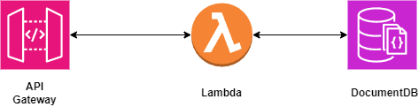

# Lambda de Autenticação do projeto Tech Chalange

## 1. Problema
Implementar um API Gateway e um function serverless para autenticar o cliente com base no CPF.
- Integrar ao sistema de autenticação para identificar o cliente.

## 2. Solução
Para suprir o necessário decidimos criar uma Lambda para cuidar do cadastro dos clientes. Por ela é possível gravar novos cadastros e autenticar os clientes já cadastrados.
  
Como a ideia do projeto não mudou a problematica, estar ou não autenticado / cadastrado não impedirá o uso dos outros recursos como fazer o pedido.

## 3. Fluxo
A API Gateway recebe a requisição podendo ser:
- get -> Para autenticar / obter o usuário cadastrado.
- post -> Para cadastrar um novo usuário.
A lambda processará a requisição obtendo ou gravando no DocumentDB de acordo com o que for solicitado.
  

